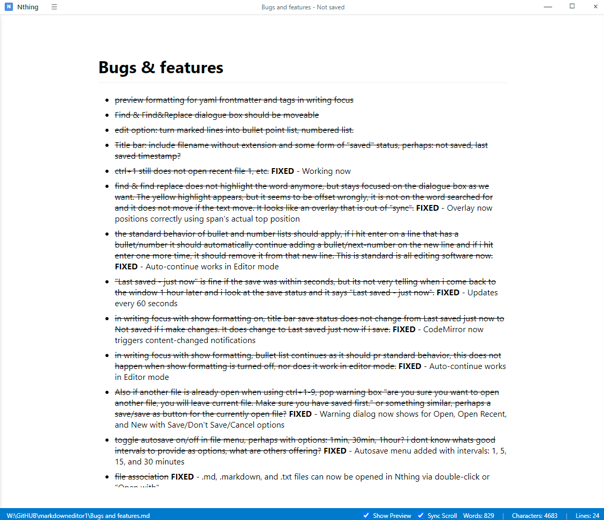
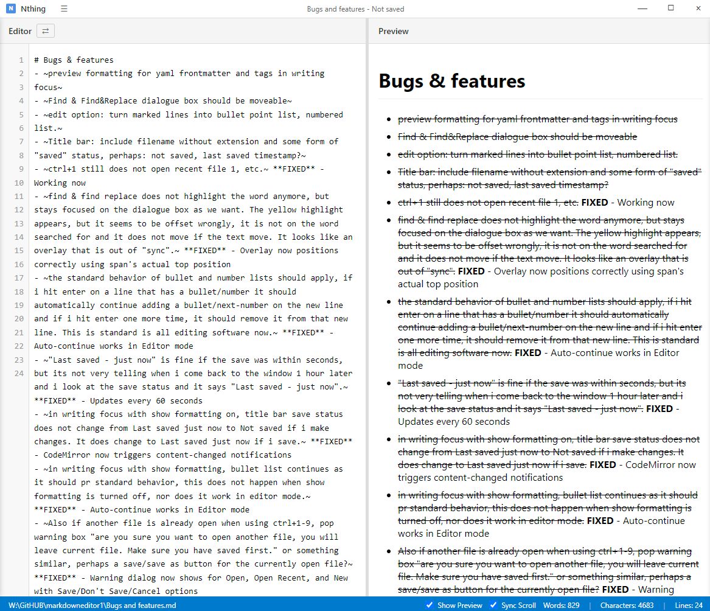
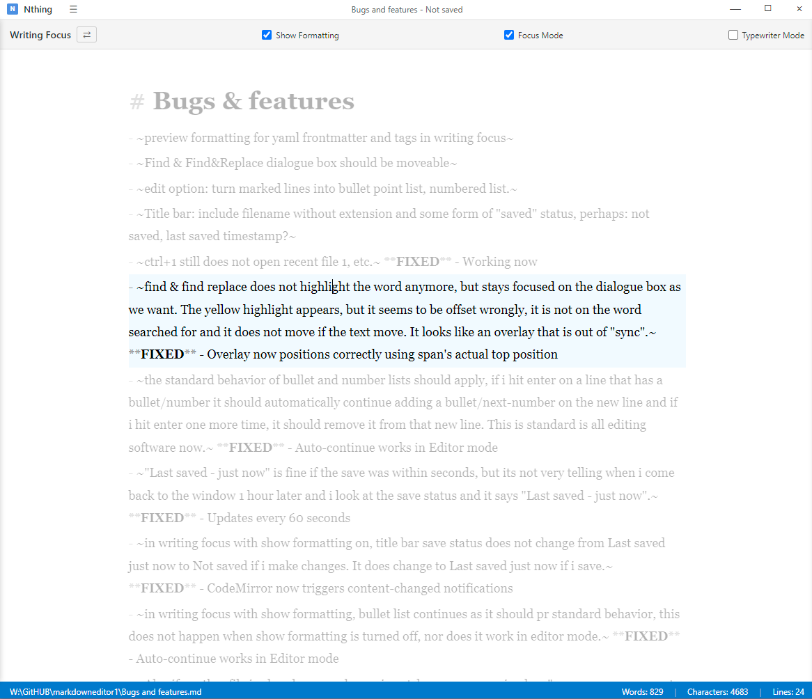
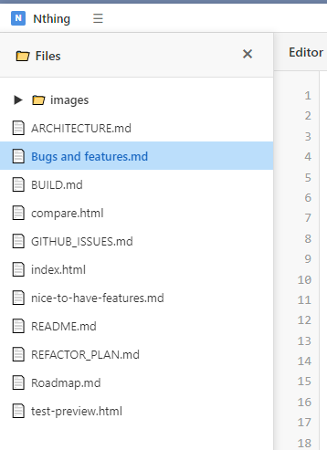
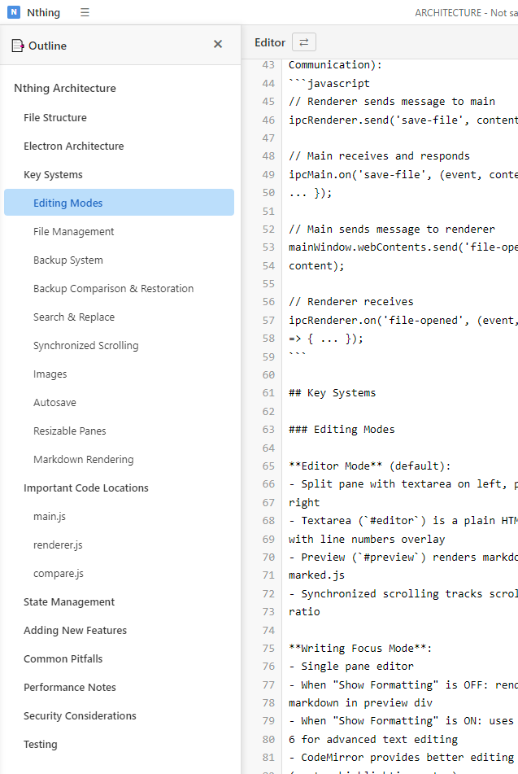
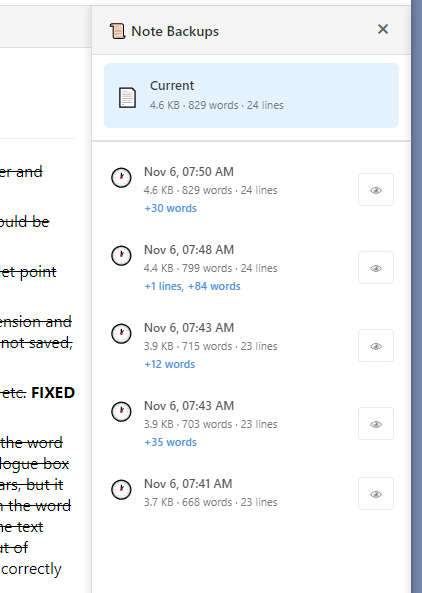

# Nthing

A markdown editor where nothing else matters. Just write.

<p align="center">
  
</p>

## What it does

There are three view modes: Editor Mode shows your markdown source on the left with a live preview on the right. Writing Focus Mode gives you a single pane with wider margins and a serif font - good for when you just want to write without seeing the raw markdown. Reader Mode displays only the rendered preview for distraction-free reading.

### Editor Mode


### Writing Focus Mode


### Reader Mode


You can cycle through modes with F9, or select them directly from the View menu. You can also set your preferred default startup mode in View → Default Startup Mode. Editor and Writing modes have Focus Mode (dims everything except the paragraph you're in) and Typewriter Mode (keeps the cursor in the middle of the screen).

The editor handles .md, .markdown, .txt, and .html files. You can open them through the file dialog, drag them into the window, double-click them in Explorer, navigate through the file tree sidebar, or pick from your recent files (Ctrl+1-9 for the last 10). Open entire workspace folders with Ctrl+K Ctrl+O to browse all your markdown files in the file tree.



The outline sidebar (Ctrl+Shift+O) shows your document structure with clickable headers for quick navigation:



Autosave works in intervals (1, 5, 15, or 30 minutes) if you want it. Status bar shows word/character/line counts.

### Backups

Every time you save, Nthing creates a backup in a `.nthing-history/` folder next to your file. It keeps up to 10 versions and uses MD5 hashing so it won't save duplicates.

Press Ctrl+Shift+H to see your backup history. Click the eye icon next to any backup to compare it with your current file. The comparison window shows what changed - red means you'll lose that line if you restore, green means you'll get it back.



You can either restore the entire backup or just pick specific lines. Click the arrows next to green lines to select them, then hit "Finalize Restoration" when you're ready.

### Other stuff

Find & Replace works (Ctrl+F and Ctrl+H). The dialog is draggable if you need to move it around.

Press Ctrl+T to insert a table template. Ctrl+Shift+7 and Ctrl+Shift+8 toggle numbered and bullet lists. Lists auto-continue when you hit Enter.

Paste images from clipboard or drag them in - they go into an `images/` folder automatically.

## Technical Features

Complete list of features:

### Editing Modes
- **Editor Mode** (split-pane)
  - Live markdown preview with synchronized scrolling
  - Line numbers
  - Monospace font (Consolas/Monaco/Courier)
  - Raw markdown source editing
  - Resizable panes with draggable separator (position persists via localStorage)
  - Bidirectional scroll sync (editor ↔ preview)

- **Writing Focus Mode** (single-pane)
  - Full-width editor with wider margins (120px)
  - Serif font (Georgia, 18px)
  - Toggle "Show Formatting" to switch between raw markdown and rendered view
  - CodeMirror 6 integration for advanced text editing when showing formatting

- **Reader Mode** (preview-only)
  - Full-width rendered preview without editor
  - Perfect for reading finished documents
  - Distraction-free reading experience
  - No editing features available in this mode

- **Mode Switching**:
  - F9 cycles through all three modes
  - View menu for direct mode selection
  - Configurable default startup mode (View → Default Startup Mode)
  - Preference persists across app restarts

- **Focus Mode** (Editor and Writing modes)
  - Dims all paragraphs except the currently active one
  - Helps maintain concentration on current section

- **Typewriter Mode** (Editor and Writing modes)
  - Keeps cursor vertically centered while typing
  - Reduces eye movement up/down

### File Management
- **Supported formats**: .md, .markdown, .txt, .html
- **Multiple open methods**:
  - File dialog (Ctrl+O)
  - Workspace folder (Ctrl+K Ctrl+O) with file tree navigation
  - Drag & drop from Windows Explorer
  - Double-click files in Explorer (registered file associations)
  - Command line arguments
  - Recent files menu (Ctrl+1-9 for last 10 files)
  - New window (Ctrl+Shift+N)
- **Autosave**:
  - Configurable intervals: 1, 5, 15, or 30 minutes
  - Enable for current session or permanently
  - Status indicator in UI
- **Unsaved changes detection**: Warns before opening/creating new files

### Backup System
- **Automatic backups on save**:
  - Stored in `.nthing-history/[filename]/` folders
  - MD5 hash deduplication (won't save identical versions)
  - Keeps up to 10 versions per file
  - Metadata tracking (timestamp, file size, word count)
- **Backup comparison window**:
  - Split-pane diff view (current vs backup)
  - Color-coded changes: red (will lose), green (will restore), white (unchanged)
  - Line-by-line comparison with git-style diff
- **Restoration options**:
  - Full backup restoration (replace entire file)
  - Interactive line restoration (select individual lines to restore)
  - Preview before finalizing changes
- **Manual snapshots**: Create backups on demand via File menu

### Search & Replace
- Case-sensitive search toggle
- Whole word matching
- Find next/previous navigation
- Replace single occurrence or all matches
- Match count and position tracking
- Visual highlighting in editor
- Draggable dialog window
- Auto-fills with selected text when opened

### Formatting Tools
- **Table insertion** (Ctrl+T): Quick table template
- **List toggling**:
  - Bullet lists (Ctrl+Shift+8)
  - Numbered lists (Ctrl+Shift+7)
  - Auto-continue on new lines
- **Markdown rendering**: Full GFM support via marked.js
- **Code syntax highlighting**: highlight.js for code blocks

### Image Support
- **Paste from clipboard** (Ctrl+V)
- **Drag & drop** from file explorer
- **Auto-save**: Images saved to `images/` folder next to document
- **Automatic markdown insertion**: Generates `` syntax
- **Inline display** in preview pane

### User Interface
- **Custom title bar** with window controls
- **Menu system**: File, Edit, Format, View, Help
- **Status bar**:
  - Real-time word count
  - Character count (including spaces)
  - Line count
  - Autosave indicator
- **File tree sidebar** (Ctrl+Shift+E):
  - Workspace folder navigation
  - Hierarchical folder/file structure with expand/collapse
  - Double-click files to open
  - Current file highlighted automatically
  - Auto-expands parent folders to reveal current file
  - Persistent expanded folder state (saved to localStorage)
  - Smart filtering: only shows .md, .markdown, .txt, .html files
  - Ignores system folders (node_modules, .git, .nthing-history)
  - Sorted alphabetically: folders first, then files
- **Outline sidebar** (Ctrl+Shift+O):
  - Document structure overview
  - Clickable headers (H1-H6) for quick navigation
  - Auto-updates as you type
  - Hierarchical indentation showing header levels
  - Active section highlighting
- **Keyboard shortcuts** for all major operations (see below)
- **Collapsible backup sidebar** (Ctrl+Shift+H)
- **Minimal, distraction-free design**

### Persistence & Storage
- **Split pane position**: Saves editor/preview ratio to localStorage
- **Recent files**: Last 10 opened files tracked
- **Autosave preferences**: Remembered between sessions
- **Default startup mode**: Your preferred view mode (editor/writing/reader) persists
- **Window state**: Position and size persist via Electron

### Markdown Support
Renders standard markdown plus:
- Headings (H1-H6)
- Bold, italic, strikethrough
- Links and images
- Ordered and unordered lists
- Code blocks with syntax highlighting
- Inline code
- Blockquotes
- Tables
- Horizontal rules
- Task lists (checkboxes)

## Installation

Download `Nthing Setup 1.12.0.exe` from releases and run it. The installer will set up file associations for .md and .markdown files so you can double-click them to open in Nthing.

Windows Defender might complain because the app isn't code-signed (certificates cost $100-400/year). It's a false positive - see the section below if you need to add an exclusion.

If you want to run from source instead:

```bash
git clone https://github.com/BahneGork/Nthing-editor.git
cd Nthing-editor
npm install
npm start
```

You'll need Node.js 14 or higher.

## Keyboard shortcuts

The usual stuff works (Ctrl+S to save, Ctrl+Z/Y for undo/redo, etc). Here are the less obvious ones:

- `Ctrl+N` - New file
- `Ctrl+Shift+N` - New window
- `Ctrl+1-9` - Open recent files (1 is most recent)
- `Ctrl+K Ctrl+O` - Open workspace folder
- `Ctrl+F` / `Ctrl+H` - Find and Find & Replace
- `Ctrl+T` - Insert table template
- `Ctrl+Shift+7/8` - Toggle numbered/bullet lists
- `Ctrl+Shift+E` - Toggle file tree sidebar
- `Ctrl+Shift+O` - Toggle outline sidebar
- `Ctrl+Shift+H` - Open backup history
- `F9` - Cycle through Editor, Writing Focus, and Reader modes
- `Esc` - Close the find dialog

There's also a menu bar with File, Edit, Format, View, and Help if you prefer clicking things. Help menu has info about the backup system and all the shortcuts.

## How the modes work

**Editor Mode** (the default) splits the window - markdown source on the left, preview on the right. Monospace font, line numbers, synchronized scrolling. Good for technical stuff or when you want to see the raw markdown.

**Writing Focus Mode** hides the preview and gives you more space. Serif font (Georgia), wider margins, bigger text. Just for writing. You can toggle "Show Formatting" if you want to see the markdown syntax, or turn it off to see rendered text.

**Reader Mode** shows only the rendered preview at full width - perfect for reading finished documents without any editing interface in the way. No editor, no controls, just your content.

Editor and Writing modes have Focus Mode (dims everything but the current paragraph) and Typewriter Mode (keeps the line you're on in the middle of the screen).

The editor and preview scroll together in Editor Mode - scroll either pane and the other follows.

You can set your preferred startup mode in View → Default Startup Mode so new windows always open the way you like.

## What markdown works

Standard stuff: headings, bold, italic, links, images, lists, code blocks, blockquotes, tables, horizontal rules. Uses marked.js for parsing and highlight.js for code syntax highlighting.

## Project structure

```
main.js         # Electron main process, backup system, menus
index.html      # Main UI
renderer.js     # Editor logic, markdown rendering
styles.css      # Main styles
compare.html    # Backup comparison window
compare.js      # Diff algorithm and line restoration
compare.css     # Comparison styles
```

Backups go in `.nthing-history/[filename]/` folders next to your files.

## Building it yourself

Run `npm run build` to create a Windows installer. It'll show up in `dist/Nthing Setup 1.12.0.exe`. There's also `npm run build:portable` if you want a standalone exe.

The project uses electron-builder. Config is in package.json if you want to tweak it.

### Windows Defender being annoying

Windows Defender will probably call it a trojan (Trojan:Win32/Wacatac.C!ml). It's a false positive - happens with unsigned Electron apps because code signing certificates cost $100-400/year and I'm not paying that.

If it blocks the exe, add an exclusion in Windows Security:
1. Open Windows Security
2. Go to "Virus & threat protection"
3. "Manage settings" > "Exclusions" > "Add or remove exclusions"
4. Add your `dist` folder

You can also report it to Microsoft at https://www.microsoft.com/en-us/wdsi/filesubmission but they're slow about it.

If you're actually distributing this to people, either get a code signing cert (DigiCert, Sectigo, or SignPath if it's open source) or just warn users about the false positive.

## Built with

Electron, marked.js for markdown parsing, CodeMirror 6 for the text editor in Writing Focus mode, highlight.js for code syntax coloring. MD5 hashing via Node's crypto module for backup deduplication.

## Roadmap

See [Roadmap.md](Roadmap.md) for planned features and future development.

## License

MIT
